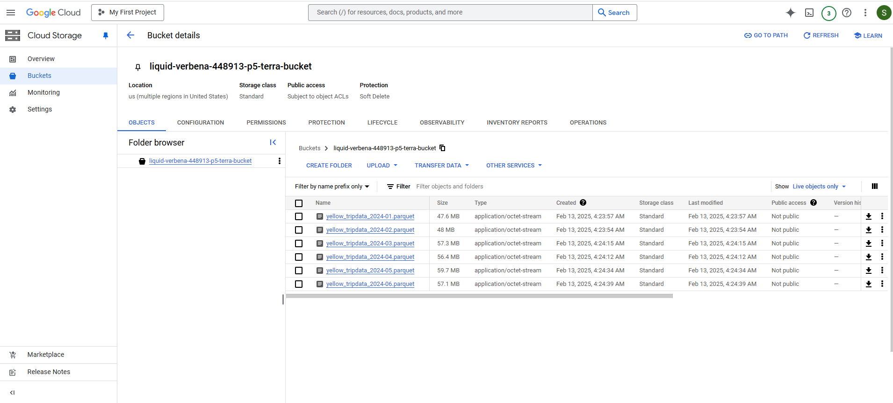
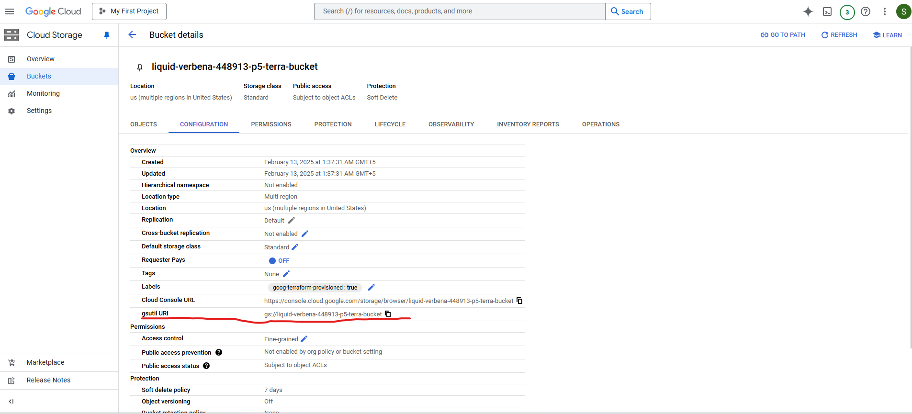

# Module 3 Homework #

 **Data loaded into the GCS Bucket _liquid-verbena-448913-p5-terra-bucket_ with the aid of the script provided [here](./load_yellow_taxi_data.py)**

 

 **Next Set up BigQuery by creating the external table using the Yellow Taxi Trip Records in my GCS Bucket. For this we need the URI of the Bucket**

 

 **External Table Creation**

 CREATE OR REPLACE EXTERNAL TABLE `taxi_dataset.external_yellow_taxitrip`
 OPTIONS (
  format = 'PARQUET',
  uris = ['gs://liquid-verbena-448913-p5-terra-bucket/yellow_tripdata_2024-*.parquet']
 );

 **Regular Table Creation with 2024 Yellow Taxi Data through the created external table**

 CREATE OR REPLACE TABLE `taxi_dataset.regular_yellow_taxitrip` AS
 SELECT * FROM `taxi_dataset.external_yellow_taxitrip`;

 **Question 1: What is count of records for the 2024 Yellow Taxi Data?**
 - SELECT count(*) FROM `liquid-verbena-448913-p5.taxi_dataset.external_yellow_taxitrip`
 - Answer: _20,332,093_

 **Question 2: Write a query to count the distinct number of PULocationIDs for the entire dataset on both the tables.**
 **What is the estimated amount of data that will be read when this query is executed on the External Table and the Table?**
 - SELECT COUNT(DISTINCT PULocationID) AS distinct_pickup_locations FROM `taxi_dataset.external_yellow_taxitrip`; (This query will process 0 B when run)
 - SELECT COUNT(DISTINCT PULocationID) AS distinct_pickup_locations FROM `taxi_dataset.regular_yellow_taxitrip`; (This query will process 155.12 MB when run)
 - Answer: _0 MB for the External Table and 155.12 MB for the Materialized Table_
 
 
 **Question 3: Write a query to retrieve the PULocationID from the table (not the external table) in BigQuery.**
 **Now write a query to retrieve the PULocationID and DOLocationID on the same table. Why are the estimated number of Bytes different?**
 - SELECT COUNT(DISTINCT PULocationID) AS distinct_pickup_locations FROM `taxi_dataset.regular_yellow_taxitrip`; (This query will process 0 B when run)
 - SELECT COUNT(DISTINCT PULocationID) AS distinct_pickup_locations, COUNT(DISTINCT DOLocationID) AS distinct_dropoff_locations FROM `taxi_dataset.regular_yellow_taxitrip`; (This query will process 310.24 MB when run)
 - Answer: _BigQuery is a columnar database, and it only scans the specific columns requested in the query. Querying two columns (PULocationID, DOLocationID) requires reading more data than querying one column (PULocationID), leading to a higher estimated number of bytes processed._

 
 **Question 4: How many records have a fare_amount of 0?**
 - SELECT COUNT(*) AS  zero_payment_trips from `taxi_dataset.regular_yellow_taxitrip` where fare_amount = 0;
 - Answer: _8333_

 **Question 5: What is the best strategy to make an optimized table in Big Query if your query will always filter based on tpep_dropoff_datetime and order the results by VendorID    (Create a new table with this strategy)**
 - Answer: _Partition by tpep_dropoff_datetime and Cluster on VendorID_
 - CREATE OR REPLACE TABLE `taxi_dataset.optimized_yellow_taxitrip`
   PARTITION BY DATE(tpep_dropoff_datetime)
   CLUSTER BY VendorID AS
   SELECT * FROM `taxi_dataset.regular_yellow_taxitrip`;

 **Question 6: Write a query to retrieve the distinct VendorIDs between tpep_dropoff_datetime 2024-03-01 and 2024-03-15 (inclusive) Use the materialized table you created earlier in your from clause and note the estimated bytes. Now change the table in the from clause to the partitioned table you created for question 5 and note the estimated bytes processed. What are these values?**
 - Answer: _310.24 MB for non-partitioned table and 26.84 MB for the partitioned table_
 - SELECT COUNT(DISTINCT VendorID) FROM `taxi_dataset.regular_yellow_taxitrip` WHERE tpep_dropoff_datetime BETWEEN '2024-03-01' AND '2024-03-15' (This query will process 310.24 MB when run)
 - SELECT COUNT(DISTINCT VendorID) FROM `taxi_dataset.optimized_yellow_taxitrip` WHERE tpep_dropoff_datetime BETWEEN '2024-03-01' AND '2024-03-15' (This query will process 26.84 MB when run)

 **Question 7: Where is the data for external tables stored?**
 - Answer: _GCP Bucket_ 

 **Question 8: It is best practice in Big Query to always cluster your data**
 - Answer: _False_
 