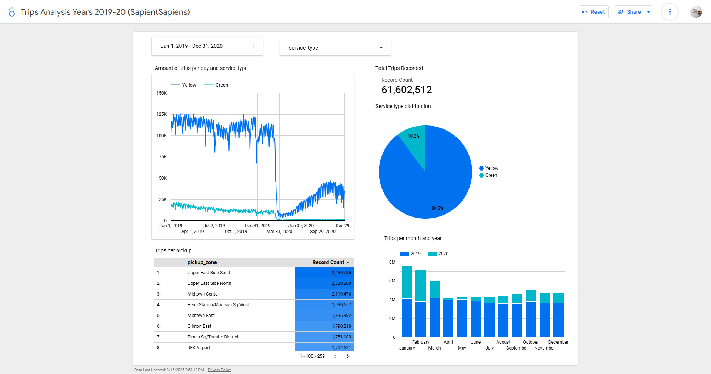

## Module 4 Homework ##

1. Created Project named dbt-siksha at GCP
2. Created service account and key and got the credentials json file downloaded to my local machine
3. Set IAM roles for Storge and BigQuery
4. Used the web_to_gcs.py script to Extract the required files from the web (existing as .csv.gz files to Google Storage Bucket as .parquet files)
5. Created a dataset/schema under dbt-siksha namely my_nyc_tripdata
6. Loaded the data from the Bucket into BigQuery
7. Transformed data in BigQuery as per instruction with dbt

### All files added and modified for the homework can be found [here](https://github.com/SapientSapiens/2025-de-zoomcamp/tree/main/homework/04/04-analytics-engineering/taxi_rides_ny) ###

## After Homework ##

- Created dataset/schema under the same db-siksha project (although in real life, it would be in a different project with different user)
- Created a production environment at dbt
- Created a job in that environment
- Running the job deployed the dbt project in the newly created schema namely prod_my_nyc_tripdata
- Then proceeded to set up Google Looker Studio with my data platform (my production schema at BigQuery)
- Created this analytics dashboard below following instructions from the zoomcamp instructor.

### The link to the created dashboard is [this](https://lookerstudio.google.com/reporting/3a325c19-3213-439a-a0ed-d9a80baa3aa4). Kindly set the pickup_datetime in the Data Selector for your specific range.